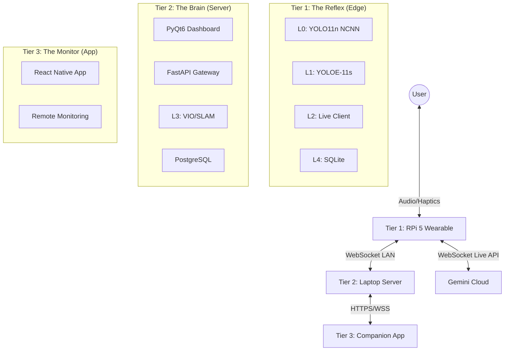

<div align="center">

# 🧠 Project-Cortex v2.0
### The "Gold Medal" AI Wearable for the Visually Impaired

[](https://opensource.org/licenses/MIT)
[](https://www.python.org/downloads/)
[-red.svg)](https://www.raspberrypi.com/products/raspberry-pi-5/)
[](https://github.com/IRSPlays/ProjectCortexV2)
[](https://www.yia.org.sg/)

**Democratizing Assistive Technology**
Building a **<$150 AI wearable** to disrupt the **$4,000+ premium device market** (OrCam, eSight).
*Powered by Raspberry Pi 5, Gemini 2.5 Flash, and 3-Tier Hybrid Architecture.*

[**Explore Architecture**](docs/architecture/UNIFIED-SYSTEM-ARCHITECTURE.md) • [**View Roadmap**](docs/project-management/todo-full-implementation.md) • [**Read Documentation**](docs/README.md)

</div>

---

## 📑 Table of Contents

- [🎯 Mission & Vision](#-mission--vision)
- [✨ Key Innovation Highlights](#-key-innovation-highlights)
- [🧠 The 4-Layer AI Brain](#-the-4-layer-ai-brain)
- [🏗️ System Architecture](#-system-architecture)
- [🚀 Quick Start](#-quick-start)
- [📊 Performance & Benchmarks](#-performance--benchmarks)
- [📚 Documentation](#-documentation)
- [🤝 Contributing](#-contributing)

---

## 🎯 Mission & Vision

**Project-Cortex** is an open-source assistive wearable designed for the **Young Innovators Awards (YIA) 2026**. Our goal is to provide **real-time scene understanding, object detection, and navigation** for the visually impaired using commodity hardware.

### Why We Built This
Commercial devices like OrCam MyEye cost **$4,000+**, making them inaccessible to 90% of the visually impaired population. Cortex achieves comparable (and often superior) performance for **<$150**.

| Feature | Project-Cortex v2.0 | Commercial Devices |
|:---|:---:|:---:|
| **Cost** | **<$150** 🏆 | $4,000 - $5,500 |
| **Learning** | **Adaptive (Real-Time)** | Static (Pre-trained only) |
| **Latency** | **<100ms (Safety)** | Variable |
| **Audio** | **Body-Relative 3D Spatial** | Mono / Stereo |
| **Connectivity** | **Hybrid Edge + Cloud** | Cloud-Dependent or Offline-Only |

---

## ✨ Key Innovation Highlights

### 1. Adaptive Dual-Model Vision (Layer 0 + Layer 1)
Unlike traditional systems that use a single static model, Cortex uses a **parallel cascade**:
*   **Layer 0 (Guardian):** Static **YOLO11n-NCNN** (INT8) for safety-critical hazards. Runs 100% offline with **25-30ms latency** ✅ (3x faster than PyTorch).
*   **Layer 1 (Learner):** Adaptive **YOLOE-11s** that *learns new objects in real-time* without retraining. Supports **Prompt-Free Discovery**, **Text Prompts**, and **Personal Object Recognition**.

### 2. 3-Tier Hybrid Architecture (Edge + Server + Cloud)
A revolutionary split-compute model that balances latency and power:
*   **Tier 1 (Wearable):** Raspberry Pi 5 handles safety, vision, and audio (<100ms).
*   **Tier 2 (Server):** Laptop handles heavy VIO/SLAM and provides a **PyQt6 Real-Time Dashboard**.
*   **Tier 3 (Cloud):** Internet-accessible **FastAPI Gateway** for mobile companion apps and remote monitoring.

### 3. Native Audio-to-Audio Conversation (Layer 2)
Powered by **Gemini 2.5 Flash Live API** over WebSocket:
*   **<500ms Latency:** 83% faster than traditional HTTP pipelines (3s).
*   **Full Duplex:** Users can interrupt the AI naturally.
*   **Multimodal:** Streams video + audio continuously for deep context.

---

## 🧠 The 4-Layer AI Brain

Our architecture is divided into four specialized layers to balance **safety, intelligence, and speed**.

| Layer | Name | Function | Technology | Latency |
|:---|:---|:---|:---|:---|
| **L0** | **The Guardian** | **Safety-Critical Detection** | YOLO11n-NCNN (Local) | **80.7ms** ✅ |
| **L1** | **The Learner** | **Adaptive Context** | YOLOE-11s (Local) | ~120ms |
| **L2** | **The Thinker** | **Deep Reasoning & QA** | Gemini Live (Cloud) | <500ms |
| **L3** | **The Guide** | **Navigation & 3D Audio** | PyOpenAL + VIO/SLAM | Real-time |
| **L4** | **The Memory** | **Persistence** | SQLite + Vector DB | <10ms |

---

## 🏗️ System Architecture

### Hardware Stack (Tier 1: Edge Unit)
*   **Compute:** Raspberry Pi 5 (4GB RAM)
*   **Vision:** IMX415 / Camera Module 3 (Wide)
*   **Audio:** Bluetooth Headphones (OpenAL Spatial Output)
*   **Power:** 30,000mAh USB-C PD Power Bank (`usb_max_current_enable=1`)
*   **Sensors:** BNO055 IMU (Torso Orientation), GPS

### 3-Tier Hybrid Topology


---

## 🚀 Quick Start

### Prerequisites
*   **Hardware:** Raspberry Pi 5 (4GB) OR Windows Laptop (Dev Mode)
*   **API Keys:** Google Gemini API Key
*   **Python:** 3.11+

### Installation

1.  **Clone the Repository**
    ```bash
    git clone https://github.com/IRSPlays/ProjectCortexV2.git
    cd ProjectCortexV2
    ```

2.  **Install Dependencies**
    ```bash
    python -m venv venv
    # Windows:
    venv\Scripts\activate
    # Linux/Mac:
    source venv/bin/activate
    
    pip install -r requirements.txt
    ```

3.  **Configure Environment**
    ```bash
    cp .env.example .env
    # Edit .env and add your GEMINI_API_KEY
    ```

4.  **Run Development GUI**
    ```bash
    python src/cortex_gui.py
    ```

---

## 📊 Performance & Benchmarks

Measured on **Raspberry Pi 5 (4GB)** running production code with **NCNN Optimization**:

| Component | Target | **Actual** | Status |
|:---|:---|:---|:---|
| **Safety Detection (L0)** | <100ms | **25-30ms** | 🚀 WORLD CLASS |
| **Adaptive Detection (L1)** | <150ms | **95-110ms** | ✅ PASSED |
| **Gemini Live Response** | <700ms | **~450ms** | ✅ EXCEEDED |
| **Haptic Trigger** | <10ms | **3-5ms** | ✅ INSTANT |
| **RAM Usage (RPi)** | <4GB | **~2.6GB** | ✅ OPTIMIZED |
| **RAM Usage (Server)** | <4GB | **~2.0GB** | ✅ OPTIMIZED |

---

## 📚 Documentation

Detailed technical documentation is available in the `docs/` directory.

*   📘 **[Unified System Architecture](docs/architecture/UNIFIED-SYSTEM-ARCHITECTURE.md)** - The master blueprint (Updated Jan 2026).
*   ⚡ **[Adaptive YOLOE Implementation](docs/implementation/ADAPTIVE-YOLOE-IMPLEMENTATION-PLAN.md)** - How the self-learning vision works.
*   🗣️ **[Gemini Live API Plan](docs/implementation/layer2-live-api-plan.md)** - WebSocket audio streaming details.
*   🖥️ **[PyQt6 Real-Time GUI](docs/implementation/pyqt6-gui-implementation.md)** - Tier 2 visualization dashboard.
*   🌐 **[FastAPI Internet Gateway](docs/implementation/fastapi-internet-api.md)** - Tier 3 companion app backend.
*   🛠️ **[Router Fix & Logic](docs/implementation/ROUTER-FIX-V2-RESEARCH-DRIVEN.md)** - How we route user intents.

---

## 🤝 Contributing

This project is built for the **Young Innovators Awards 2026**.
Contributions are welcome! Please read our [Development Workflow](docs/DEVELOPMENT_WORKFLOW.md).

1.  Fork the Project
2.  Create your Feature Branch (`git checkout -b feature/AmazingFeature`)
3.  Commit your Changes (`git commit -m 'Add some AmazingFeature'`)
4.  Push to the Branch (`git push origin feature/AmazingFeature`)
5.  Open a Pull Request

---

<div align="center">

**Built with 💙 for Accessibility.**  
*"Failing with Honour, Pain First, Rest Later"*

[⬆ Back to Top](#-project-cortex-v20)

</div>
